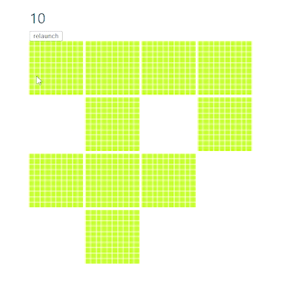
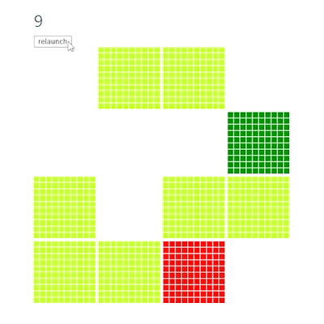
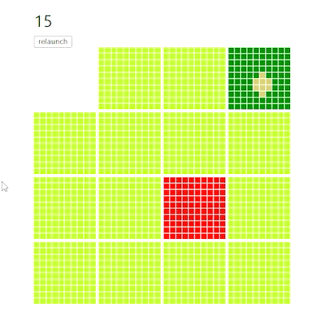

# Hi! This is my portfolio

## You can see a demo [here](https://khalbay.github.io).

## How the game was created:

### First stage playing field and markings

- I decided to make a playing field 400x400 cells.
- Cells will be in chunks. There are 100 cells in one chunk.
- And the field itself consists of 4x4 chunks
- Each chunk is responsible for a separate room, for example start or finish or empty.
- From all this will consist of 1 level of the game. Which will use procedural generation to generate rooms.

### The second stage is procedural level generation

- I have implemented procedural generation via `Math.random()`.
- To begin with, I determined that I need at least 7 rooms to create a full level.  

- The next step was to define the first 2 types of chunks - "start" - green and "finish" - red.  

- Next, the most difficult thing is to make the procedural generation of the room inside the chunk. Here you need to have at least 16 tiles of which then there will be a 2x2 room surrounded by walls.

- Here I used Dijkstra's algorithm to build the room tile by tile until the number generated to build the room runs out.
- Here the function is divided into 2 parts, first we fill only half of the total number of the room, then I calculate the boundaries of the walls and fill in the rest to make a rectangle.


other...

```sh
npm install
```

### Compile and Hot-Reload for Development

```sh
npm run dev
```

### Type-Check, Compile and Minify for Production

```sh
npm run build
```
